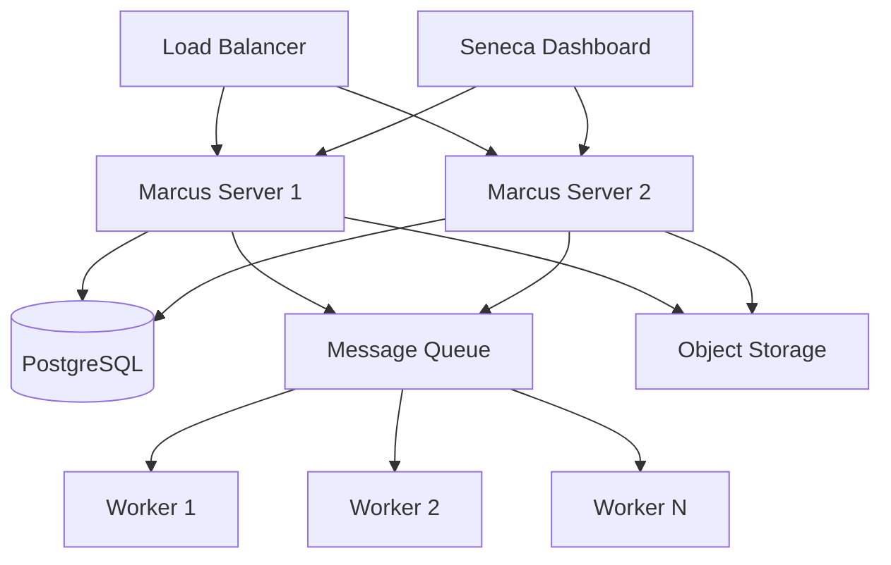

# Production Deployment Guide

This guide covers deploying Marcus AI and Seneca to production environments with best practices for reliability, security, and performance.

## Overview

Production deployment requires careful consideration of:
- High availability
- Security hardening
- Performance optimization
- Monitoring and alerting
- Disaster recovery

## Architecture Overview



## Infrastructure Requirements

### Minimum Requirements

| Component | CPU | Memory | Storage | Network |
|-----------|-----|---------|---------|---------|
| Marcus Server | 4 cores | 16GB | 100GB SSD | 1Gbps |
| Database | 8 cores | 32GB | 500GB SSD | 10Gbps |
| Workers | 2 cores | 8GB | 50GB SSD | 1Gbps |
| Seneca | 2 cores | 4GB | 20GB SSD | 1Gbps |

### Recommended Setup

- **Marcus Servers**: 2+ instances for HA
- **Database**: PostgreSQL with streaming replication
- **Message Queue**: Redis or RabbitMQ cluster
- **Object Storage**: S3-compatible storage
- **Load Balancer**: HAProxy or cloud LB

## Deployment Methods

### Docker Deployment

```dockerfile
# Dockerfile.marcus
FROM python:3.11-slim

WORKDIR /app

COPY requirements.txt .
RUN pip install --no-cache-dir -r requirements.txt

COPY . .

EXPOSE 8000
CMD ["gunicorn", "marcus.wsgi:app", "--bind", "0.0.0.0:8000"]
```

```yaml
# docker-compose.prod.yml
version: '3.8'

services:
  marcus:
    image: marcus:latest
    deploy:
      replicas: 2
    environment:
      - DATABASE_URL=postgresql://user:pass@db:5432/marcus
      - REDIS_URL=redis://redis:6379
      - SECRET_KEY=${SECRET_KEY}
    depends_on:
      - db
      - redis
    
  db:
    image: postgres:15
    volumes:
      - postgres_data:/var/lib/postgresql/data
    environment:
      - POSTGRES_DB=marcus
      - POSTGRES_USER=user
      - POSTGRES_PASSWORD=${DB_PASSWORD}
    
  redis:
    image: redis:7-alpine
    command: redis-server --requirepass ${REDIS_PASSWORD}
    
  seneca:
    image: seneca:latest
    ports:
      - "80:80"
    environment:
      - API_URL=http://marcus:8000
      - NODE_ENV=production

volumes:
  postgres_data:
```

### Kubernetes Deployment

```yaml
# marcus-deployment.yaml
apiVersion: apps/v1
kind: Deployment
metadata:
  name: marcus
  labels:
    app: marcus
spec:
  replicas: 3
  selector:
    matchLabels:
      app: marcus
  template:
    metadata:
      labels:
        app: marcus
    spec:
      containers:
      - name: marcus
        image: marcus:latest
        ports:
        - containerPort: 8000
        env:
        - name: DATABASE_URL
          valueFrom:
            secretKeyRef:
              name: marcus-secrets
              key: database-url
        resources:
          requests:
            memory: "8Gi"
            cpu: "2"
          limits:
            memory: "16Gi"
            cpu: "4"
        livenessProbe:
          httpGet:
            path: /health
            port: 8000
          initialDelaySeconds: 30
          periodSeconds: 10
        readinessProbe:
          httpGet:
            path: /ready
            port: 8000
          initialDelaySeconds: 5
          periodSeconds: 5
```

### Cloud-Specific Deployments

#### AWS

```terraform
# main.tf
resource "aws_ecs_service" "marcus" {
  name            = "marcus"
  cluster         = aws_ecs_cluster.main.id
  task_definition = aws_ecs_task_definition.marcus.arn
  desired_count   = 3

  deployment_configuration {
    maximum_percent         = 200
    minimum_healthy_percent = 100
  }

  load_balancer {
    target_group_arn = aws_lb_target_group.marcus.arn
    container_name   = "marcus"
    container_port   = 8000
  }
}
```

## Security Configuration

### SSL/TLS Setup

```nginx
# nginx.conf
server {
    listen 443 ssl http2;
    server_name marcus.example.com;

    ssl_certificate /etc/ssl/certs/marcus.crt;
    ssl_certificate_key /etc/ssl/private/marcus.key;
    ssl_protocols TLSv1.2 TLSv1.3;
    ssl_ciphers HIGH:!aNULL:!MD5;

    location / {
        proxy_pass http://marcus-backend;
        proxy_set_header X-Real-IP $remote_addr;
        proxy_set_header X-Forwarded-For $proxy_add_x_forwarded_for;
        proxy_set_header X-Forwarded-Proto $scheme;
    }
}
```

### Environment Variables

```bash
# .env.production
SECRET_KEY=your-secret-key-here
DATABASE_URL=postgresql://user:pass@db:5432/marcus
REDIS_URL=redis://:password@redis:6379/0
S3_BUCKET=marcus-production
AWS_ACCESS_KEY_ID=xxx
AWS_SECRET_ACCESS_KEY=xxx
SENTRY_DSN=https://xxx@sentry.io/xxx
```

### Security Hardening

1. **Network Security**:
   ```yaml
   # security-group.yaml
   ingress:
     - protocol: tcp
       from_port: 443
       to_port: 443
       cidr_blocks: ["0.0.0.0/0"]
   egress:
     - protocol: -1
       cidr_blocks: ["10.0.0.0/8"]
   ```

2. **Database Security**:
   ```sql
   -- Create application user with limited permissions
   CREATE USER marcus_app WITH PASSWORD 'secure_password';
   GRANT CONNECT ON DATABASE marcus TO marcus_app;
   GRANT USAGE ON SCHEMA public TO marcus_app;
   GRANT SELECT, INSERT, UPDATE, DELETE ON ALL TABLES IN SCHEMA public TO marcus_app;
   ```

3. **API Security**:
   ```python
   # security.py
   from flask_limiter import Limiter
   
   limiter = Limiter(
       app,
       key_func=get_remote_address,
       default_limits=["1000 per hour"]
   )
   
   @app.before_request
   def enforce_security_headers():
       @after_this_request
       def set_security_headers(response):
           response.headers['X-Content-Type-Options'] = 'nosniff'
           response.headers['X-Frame-Options'] = 'DENY'
           response.headers['X-XSS-Protection'] = '1; mode=block'
           response.headers['Strict-Transport-Security'] = 'max-age=31536000'
           return response
   ```

## Performance Optimization

### Database Optimization

```sql
-- Create indexes for common queries
CREATE INDEX idx_tasks_status ON tasks(status);
CREATE INDEX idx_tasks_agent_id ON tasks(agent_id);
CREATE INDEX idx_tasks_created_at ON tasks(created_at);

-- Partition large tables
CREATE TABLE tasks_2024_01 PARTITION OF tasks
FOR VALUES FROM ('2024-01-01') TO ('2024-02-01');
```

### Caching Strategy

```python
# cache.py
import redis
from functools import wraps

redis_client = redis.Redis.from_url(os.environ['REDIS_URL'])

def cache_result(expire=3600):
    def decorator(func):
        @wraps(func)
        def wrapper(*args, **kwargs):
            cache_key = f"{func.__name__}:{str(args)}:{str(kwargs)}"
            result = redis_client.get(cache_key)
            
            if result:
                return json.loads(result)
            
            result = func(*args, **kwargs)
            redis_client.setex(cache_key, expire, json.dumps(result))
            return result
        return wrapper
    return decorator
```

### Resource Limits

```yaml
# resource-limits.yaml
resources:
  limits:
    cpu: "4"
    memory: "16Gi"
    ephemeral-storage: "10Gi"
  requests:
    cpu: "2"
    memory: "8Gi"
    ephemeral-storage: "5Gi"
```

## Monitoring and Alerting

### Prometheus Configuration

```yaml
# prometheus.yml
global:
  scrape_interval: 15s

scrape_configs:
  - job_name: 'marcus'
    static_configs:
      - targets: ['marcus:8000']
    metrics_path: '/metrics'
```

### Grafana Dashboards

```json
{
  "dashboard": {
    "title": "Marcus Production Metrics",
    "panels": [
      {
        "title": "Request Rate",
        "targets": [
          {
            "expr": "rate(http_requests_total[5m])"
          }
        ]
      },
      {
        "title": "Error Rate",
        "targets": [
          {
            "expr": "rate(http_requests_total{status=~\"5..\"}[5m])"
          }
        ]
      }
    ]
  }
}
```

### Alert Rules

```yaml
# alerts.yml
groups:
  - name: marcus
    rules:
      - alert: HighErrorRate
        expr: rate(http_requests_total{status=~"5.."}[5m]) > 0.05
        for: 5m
        annotations:
          summary: "High error rate detected"
          
      - alert: DatabaseConnectionFailure
        expr: mysql_up == 0
        for: 1m
        annotations:
          summary: "Database connection lost"
```

## Backup and Recovery

### Automated Backups

```bash
#!/bin/bash
# backup.sh
DATE=$(date +%Y%m%d_%H%M%S)
BACKUP_DIR="/backups"

# Database backup
pg_dump $DATABASE_URL > $BACKUP_DIR/db_$DATE.sql
gzip $BACKUP_DIR/db_$DATE.sql

# Upload to S3
aws s3 cp $BACKUP_DIR/db_$DATE.sql.gz s3://marcus-backups/

# Cleanup old backups
find $BACKUP_DIR -name "*.gz" -mtime +7 -delete
```

### Disaster Recovery Plan

1. **RPO/RTO Targets**:
   - Recovery Point Objective: < 1 hour
   - Recovery Time Objective: < 4 hours

2. **Backup Schedule**:
   - Full backup: Daily
   - Incremental: Hourly
   - Transaction logs: Continuous

3. **Recovery Procedures**:
   ```bash
   # Restore from backup
   kubectl scale deployment marcus --replicas=0
   psql $DATABASE_URL < backup.sql
   kubectl scale deployment marcus --replicas=3
   ```

## Scaling Strategies

### Horizontal Scaling

```yaml
# hpa.yaml
apiVersion: autoscaling/v2
kind: HorizontalPodAutoscaler
metadata:
  name: marcus-hpa
spec:
  scaleTargetRef:
    apiVersion: apps/v1
    kind: Deployment
    name: marcus
  minReplicas: 2
  maxReplicas: 10
  metrics:
  - type: Resource
    resource:
      name: cpu
      target:
        type: Utilization
        averageUtilization: 70
  - type: Resource
    resource:
      name: memory
      target:
        type: Utilization
        averageUtilization: 80
```

### Vertical Scaling

Monitor and adjust resource limits based on usage patterns:

```python
# monitoring.py
def check_resource_usage():
    cpu_usage = get_cpu_usage()
    memory_usage = get_memory_usage()
    
    if cpu_usage > 90:
        alert("High CPU usage", level="warning")
    
    if memory_usage > 85:
        alert("High memory usage", level="warning")
```

## Maintenance Procedures

### Rolling Updates

```bash
# deploy.sh
#!/bin/bash
kubectl set image deployment/marcus marcus=marcus:$NEW_VERSION
kubectl rollout status deployment/marcus
kubectl rollout history deployment/marcus
```

### Database Migrations

```python
# migrate.py
from alembic import command
from alembic.config import Config

def run_migrations():
    alembic_cfg = Config("alembic.ini")
    command.upgrade(alembic_cfg, "head")
```

## Troubleshooting

### Common Issues

1. **High Memory Usage**:
   - Check for memory leaks
   - Adjust worker pool size
   - Enable memory profiling

2. **Slow Response Times**:
   - Check database query performance
   - Review caching strategy
   - Enable APM tracing

3. **Connection Errors**:
   - Verify network connectivity
   - Check security group rules
   - Review connection pool settings

### Debug Tools

```python
# debug.py
import logging
import sys

# Enable debug logging
logging.basicConfig(
    level=logging.DEBUG,
    format='%(asctime)s - %(name)s - %(levelname)s - %(message)s',
    handlers=[
        logging.FileHandler('debug.log'),
        logging.StreamHandler(sys.stdout)
    ]
)
```

## Next Steps

- Review [Troubleshooting Guide](troubleshooting.md)
- Set up [Monitoring](../marcus/systems/11-monitoring-systems.md)
- Join our [Community](../community/support.md) for support